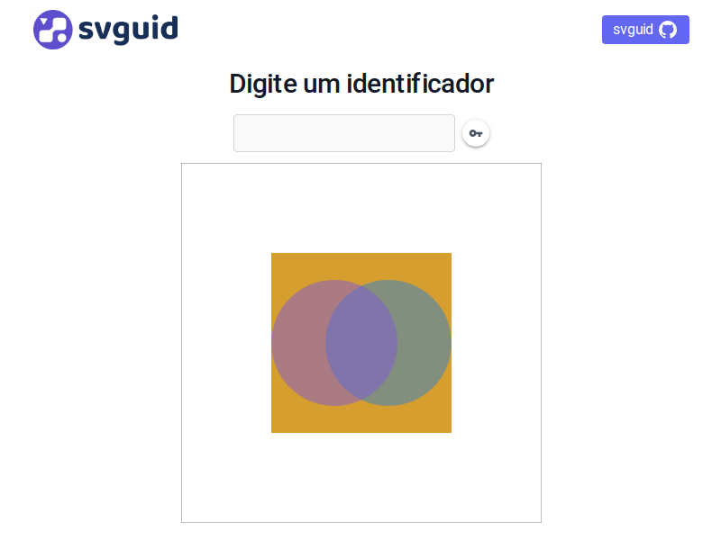
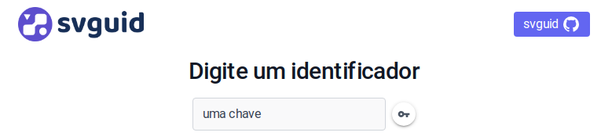
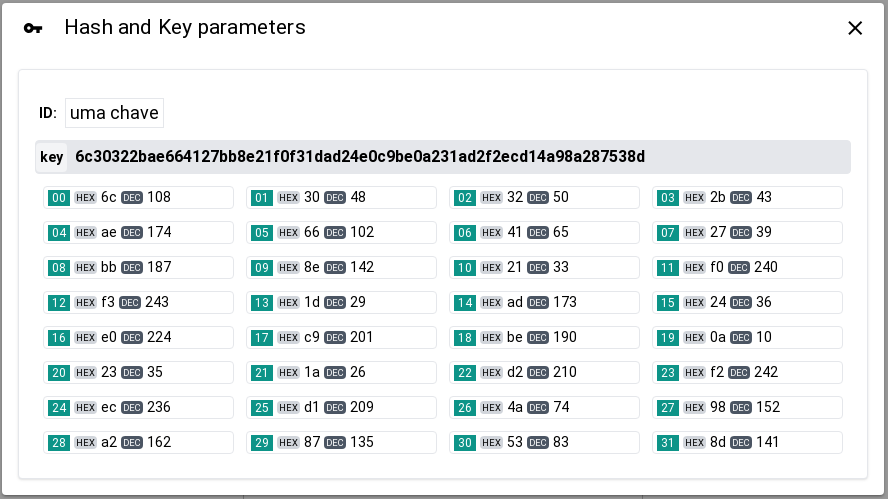

 
> Versão alpha beta gama ....
>

## Como rodar?

Clone ou faça o download deste repositório. Acesse a pasta, instale as dependências e execute-o com `npm run dev`  

```bash
git clone https://github.com/mmamorim/svguid.git
cd svguid
npm install
npm run dev
```

Abra o navegador e acesse a url: `http://localhost:5173/`



Cada identificador digitado irá gerar uma chave hash que poderá ser visualizada a partir do botão ao lado.





## Como criar um algoritmo para gerar avatar?

🧑‍💻 Na pasta `src/widget/` você irá encontrar um arquivo `widget.js`. Este arquivo exporta uma função que será executada toda vez que o identificador é atualizado. Esta função receberá dois parâmetros `(key, draw)` que representa respectiamente: 

> `key`: um objeto pelo qual você poderá acessar o hash gerado a partir do identificador digitado (ver mais explicações abaixo)
> `draw`: um objeto da biblioteca `svg.js` que disponibiliza métodos que facilitam a criação da imagem vetorial. (ver mais explicações abaixo)  

O arquivo `widget.js` apresenta um simples exemplo inicial de uso:

~~~javascript 
import { getColorIterator } from "./utils/colors/color.js"
import sample from "./examples/widget00.js"

function widget(key, draw) {
    
    let nextColor = getColorIterator(key)

    draw.rect().size(500,500).move(250,250).fill(nextColor())
    draw.circle().size(350).move(400,325).fill(nextColor()).opacity(0.5)
    draw.circle().size(350).move(250,325).fill(nextColor()).opacity(0.5)
    
    // Descomente linha abaixo para ver exemplo 0
    //sample(key,draw)
}

export default widget
~~~

🧑‍💻 Na pasta `src/widget/examples` você irá encontrar diversos exemplos.

### Sobre o parâmetro `key`

Como queremos que as imagens sejam únicas e sempre a mesma para cada identificador, em vez de usar algo aleatório, iremos usar o objeto `key`:

Métodos:
> `key.next()`: retorna um inteiro entre 1 a 1000 
> `key.next256()`: retorna um inteiro entre 0 a 255 
> `key.next16()`: retorna um inteiro entre 0 a 15 

### Sobre o parâmetro `draw`

É um objeto da biblioteca `svg.js` que disponibiliza métodos que facilitam a criação da imagem vetorial:

Métodos:
> `draw.rect()`: **desenha um retângulo**
> `draw.rect().size(width, height)`: define largura e altura
> `draw.rect().move(x, y)`: posiciona o canto superior esquerdo do retângulo
> `draw.rect().fill(color)`: preenche retângulo com a cor `color`

> `draw.circle()`: **desenha um circulo**
> `draw.circle().size(radius)`: define o raio do círculo
> `draw.circle().move(x, y)`: posiciona o canto superior esquerdo do circulo
> `draw.circle().fill(color)`: preenche círculo com a cor `color`

> `draw.polyline([x1,y1,...,xn,yn])`: **desenha um polígono** a partir do vetor de pontos
> `draw.polyline().move(x, y)`: posiciona o canto superior esquerdo do polígono
> `draw.polyline().fill(color)`: preenche polígono com a cor `color`

## Utilitários

Na pasta `src/widget/utils` existem utilitários para ajudar na criação das imagens.

### Sobre `getColorIterator`

Disponibiliza uma função `getColorIterator` que devolve um iterador de cores.

~~~javascript 
import { getColorIterator } from "../utils/colors/color.js"
~~~

~~~javascript 
let nextColor = getColorIterator(key)
// a cada chamada do iterador nextColor() devolve uma cor diferente 
nextColor()
~~~

### Sobre a criação de `blob`

O arquivo `src/widget/utils/blob/blob.js` disponibiliza uma função `blob(number)` que recebe um valor inteiro como chave e devolve um objeto que desenha um blob. ver [exemplo05](./src/widget/examples/widget05.js)

~~~javascript 
import blob from "../utils/blob/blob.js"
~~~

~~~javascript 
// trecho que cria e desenha uma blob
let b = blob(key.next())
b.fill("green").move(50,50).size(700)
b.addTo(draw)
~~~

### Sobre a criação de `shape`

O arquivo `src/widget/utils/shape/shape.js` disponibiliza uma função `shape(number)` que recebe um valor inteiro como chave e devolve um objeto que desenha um shape. ver [exemplo07](./src/widget/examples/widget07.js)

~~~javascript 
import shape from "../utils/shape/shape.js"
~~~

~~~javascript 
// trecho que cria e desenha um shape
let s = shape(key.next())
s.fill("green").move(50,50).size(700)
s.addTo(draw)
~~~

